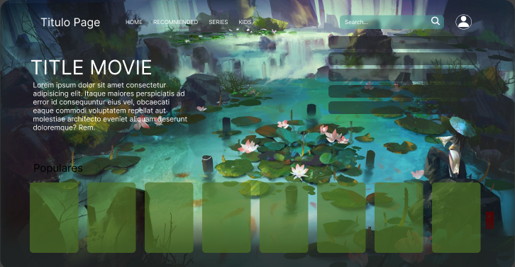

## #ApiMovie_Practice

##### Design

**Description**
Un proyecto de practica, donde se usa Api para llamar películas con sus detalles de una pagina externa, aquí se maneja el HTML; CSS y JAVASCRIPT (Sin extensiones), también se practico código haciendo carrusel, buscador y animaciones de hover.

**Herramientas**

    
    
    
</div
